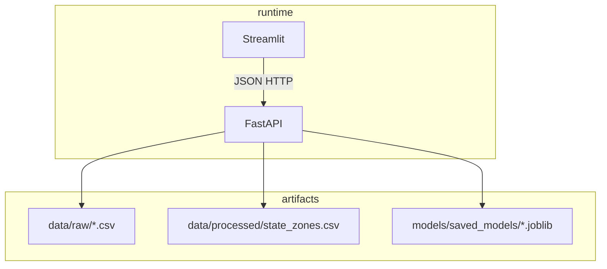
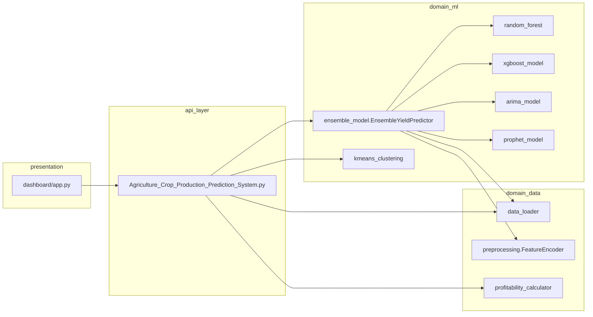
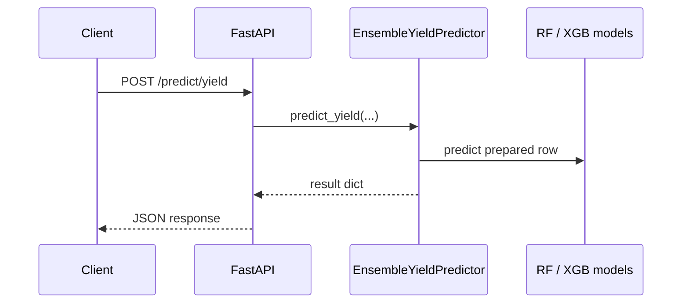
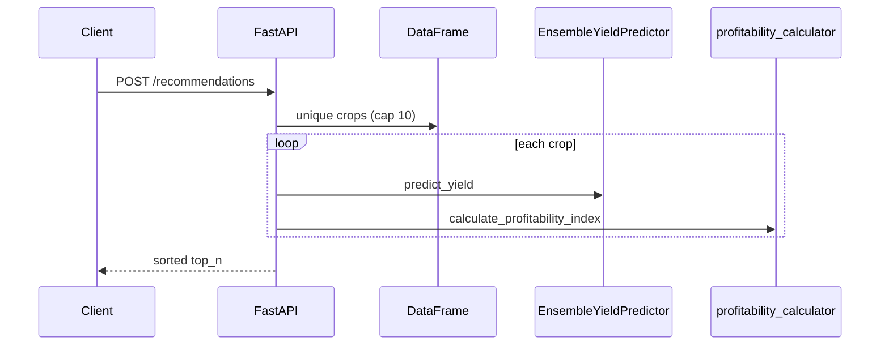

# Combined System Design — Agriculture Crop Production Prediction

This document merges **high-level design (HLD)** and **low-level design (LLD)** into a single reference for architecture, behavior, and implementation.

---

## 1. Purpose and scope

### 1.1 Problem

Farmers and analysts need **yield estimates**, **production trend views**, **profitability signals**, and **region-aware crop suggestions** from historical agricultural records (Indian crop production context).

### 1.2 Solution (in scope)

| Capability | Delivery |
|------------|----------|
| Yield prediction | REST: tree-based ensemble (Random Forest + XGBoost), with fallbacks |
| Production trends | REST: Prophet → ARIMA → mean extrapolation |
| Profitability | REST: formula on predicted yield × price ÷ cost |
| Zone labeling | K-Means on state aggregates; optional zone metadata |
| Exploration UI | Streamlit dashboard calling the API over HTTP |

### 1.3 Out of scope (current codebase)

Authenticated multi-tenant APIs, real-time market data feeds, mobile apps, separate inference microservice, automated CI model registry.

---

## 2. Stakeholders and use cases

| Actor | Goal |
|-------|------|
| End user (dashboard) | Explore predictions, trends, recommendations |
| API client | Integrate yield/profit/recommendations into another system |
| Data scientist / engineer | Train models, refresh artifacts, validate data |

**Primary use cases:** predict yield for (crop, state, season, year, cost); forecast production over years; rank crops by profitability for a state; list productivity zones.

---

## 3. System context (HLD)

```mermaid
C4Context
  title System context (conceptual)
  Person(user, "User", "Uses dashboard or API client")
  System(api, "Prediction API", "FastAPI — yield, trends, profitability, zones")
  SystemDb(files, "Files", "CSV + joblib on disk")
  Person(user, "User")
  user --> api
  api --> files
```

**External dependency:** Dashboard assumes API at `http://localhost:8000` unless configured otherwise in `dashboard/app.py`.

---

## 4. Container / deployment view

| Container | Entry | Port (default) | Notes |
|-----------|--------|------------------|-------|
| API server | `run_api.py` → `src.api.Agriculture_Crop_Production_Prediction_System:app` | 8000 | Uvicorn; CORS `*` |
| Dashboard | `run_dashboard.py` / `streamlit run dashboard/app.py` | Streamlit default | HTTP client to API |
| Training job | `train_models.py` | N/A | Writes `models/saved_models/`, `data/processed/` |

**Path assumption:** Processes run with **project root as cwd** so relative paths `data/`, `models/` resolve correctly.



---

## 5. Logical architecture (HLD + module map)



**Dependency rule:** `dashboard` must not import `src` for inference; only the API owns orchestration.

---

## 6. Data design

### 6.1 Primary dataset (tabular)

Expected columns used across training and API paths include:

- **Categorical:** `Crop`, `State`, `Season`, optionally `Variety`
- **Numeric:** `Year`, `Quantity` (yield target), `Production`, `Cost`
- **Derived (training):** `Year_Squared`, `Cost_per_Unit`, `Production_per_Cost`

### 6.2 Data loading behavior (`src/utils/data_loader.py`)

1. Explicit path, or search under `data/raw/` (prioritized filenames), or nested known folder, or first `.csv`.
2. If none found: **synthetic** `generate_sample_data()` and optional write to `data/raw/sample_data.csv`.
3. `preprocess_data()`: imputation, IQR-based row filter on numeric columns, feature engineering.

### 6.3 Processed / model artifacts

| Artifact | Producer | Consumer |
|----------|----------|----------|
| `models/saved_models/random_forest_model.joblib` | `train_models.py` | `EnsembleYieldPredictor` |
| `models/saved_models/xgboost_model.joblib` | `train_models.py` | `EnsembleYieldPredictor` |
| `models/saved_models/feature_encoder.joblib` | `train_models.py` | `EnsembleYieldPredictor._prepare_input` |
| `models/saved_models/kmeans_clusterer.joblib` | `train_models.py` | API startup + `/recommendations`, `/zones` |
| `data/processed/state_zones.csv` | `train_models.py` | `/zones` when clusterer present |

---

## 7. ML design (training vs serving)

### 7.1 Training pipeline (`train_models.py`)

1. `load_data()` → `preprocess_data()`.
2. `prepare_model_features()` → `X`, `y`, `FeatureEncoder`.
3. Train **RandomForestYieldPredictor** and **XGBoostYieldPredictor**; save joblib.
4. Aggregate by `State`; train **ProductivityZoneClusterer** (optional `find_optimal=True`); save clusterer + `state_zones.csv`.
5. Save encoder to `feature_encoder.joblib`.

### 7.2 Inference — yield (`EnsembleYieldPredictor.predict_yield`)

- Load encoder + tree models if present.
- Build single-row features; encode categoricals (unseen labels handled with defaults).
- Combine RF/XGB predictions with normalized weights; **ARIMA/Prophet skipped** on this path for latency.
- If no models: **heuristic** yield by crop name.
- Output: `predicted_yield`, Gaussian-style `confidence_interval` from spread of constituent preds, `model_used` string.

### 7.3 Inference — production trends (`predict_production_trends`)

- `prepare_time_series(df, crop, state)` → series.
- Try **Prophet** (train on request) → else **ARIMA** → else **flat mean** by crop/state.

### 7.4 Profitability (`calculate_profitability_index`)

- `expected_revenue = predicted_yield * market_price`
- `profitability_index = expected_revenue / cost` (cost &gt; 0 required)
- Textual recommendation from index thresholds.

### 7.5 Clustering at API time

- State row aggregated: mean `Quantity`, `Cost`, `Production`.
- `clusterer.predict_zone(dict)` → zone id; human-readable `Zone {id+1}` in recommendations.

---

## 8. API contract (summary)

| Method | Path | Request body | Response (conceptual) |
|--------|------|--------------|------------------------|
| GET | `/` | — | Service name, `models_loading`, `models_ready`, links |
| GET | `/health` | — | `models_loaded` map, `data_loaded`, timestamp |
| POST | `/predict/yield` | `crop`, `state`, `season`, `year`, `cost` | `predicted_yield`, `confidence_interval`, `model_used`, `timestamp` |
| POST | `/predict/production` | `crop`, `state`, `start_year`, `end_year` | `forecast[]`, `trend`, `model_used`, `timestamp` |
| POST | `/profitability` | `crop`, `state`, `market_price`, `cost` | profitability fields + `timestamp` (yield uses fixed season/year in current implementation) |
| POST | `/recommendations` | `state`, `budget`, `season`, `top_n?` | ranked list, `zone`, `timestamp` |
| GET | `/zones` | — | `zones[]`, `total_zones`, `timestamp` |

**OpenAPI:** `/docs` (FastAPI auto-generated).

---

## 9. Runtime behavior (LLD — lifecycle and concurrency)

### 9.1 Module-level singletons (API module)

- `ensemble_predictor`, `clusterer`, `df_data`, `_models_loading`.

### 9.2 Startup

- `startup` event starts a **daemon thread** running `load_models_background()`:
  - Instantiate ensemble → `load_models()`.
  - Load K-Means joblib if exists.
  - `load_data("data/raw/crop_production_data.csv")` into `df_data`.

### 9.3 Request path

- If global ensemble is `None`, some routes construct a **local** `EnsembleYieldPredictor` and `load_models()` (extra I/O under load).

### 9.4 Concurrency caveat

- Globals are shared across workers; multi-worker deployments should treat model loading and caching explicitly (not implemented).

---

## 10. Sequence diagrams

### 10.1 Yield prediction



### 10.2 Recommendations



---

## 11. Dashboard integration (HLD)

- **Technology:** Streamlit + Plotly + `requests` to REST API.
- **Configuration:** `API_BASE_URL` must match running API host/port.
- **Failure modes:** Network errors surface in UI; API may still be warming up while `models_loading` is true.

---

## 12. Cross-cutting concerns

| Topic | Design choice |
|-------|----------------|
| Resilience | Heuristic yield; synthetic data; `/zones` fallback when clusterer missing |
| Security | No auth; permissive CORS — tighten for production |
| Observability | Print logging in loaders; HTTP exceptions return 500 with message |
| Performance | Time-series refit per production request may be slow; recommendations loop capped at 10 crops |

---

## 13. Evolution hooks

- Centralize **paths and prices** (env or config file).
- Extract **service layer** between FastAPI routes and `EnsembleYieldPredictor` for testing.
- Add **request-level caching** for repeated yield queries.
- Optional **pre-trained** Prophet/ARIMA artifacts instead of fit-per-request for production trends.

---

## 14. Source map (quick reference)

| Concern | Primary file(s) |
|---------|------------------|
| HTTP app, DTOs, routes | `src/api/Agriculture_Crop_Production_Prediction_System.py` |
| Ensemble logic | `src/models/ensemble_model.py` |
| Training orchestration | `train_models.py` |
| Data I/O | `src/utils/data_loader.py` |
| Encoding | `src/utils/preprocessing.py` |
| Profitability | `src/utils/profitability_calculator.py` |
| Zones | `src/clustering/kmeans_clustering.py` |
| UI | `dashboard/app.py` |

---

*This combined design reflects the repository layout and behavior as implemented. README paths mentioning `src/api/main.py` are outdated; the live application module is `Agriculture_Crop_Production_Prediction_System.py`.*
